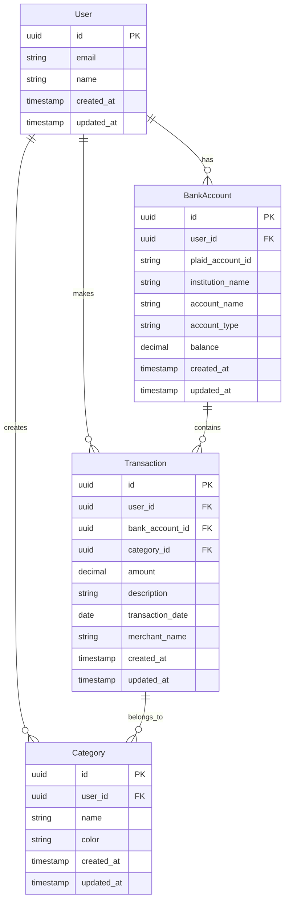

# Finance Tracker Architecture

## MVP User Stories

### Authentication & User Management
- As a new user, I want to sign up using my email or Google account
- As a user, I want to securely log in to my account
- As a user, I want to update my profile information

### Bank Account Integration
- As a user, I want to connect my bank account using Plaid
- As a user, I want to see a list of my connected bank accounts
- As a user, I want to disconnect a bank account

### Transaction Management
- As a user, I want to see my recent transactions
- As a user, I want to categorize my transactions
- As a user, I want to search and filter my transactions

### Financial Insights
- As a user, I want to see my spending by category
- As a user, I want to view my monthly spending trends
- As a user, I want to see my top spending categories

## System Architecture

The system architecture is documented in the following diagrams:

- [System Architecture Diagram](../architecture.mmd) - Shows the high-level components and their interactions

## Entity Relationship Diagram

## Key Entities

### User
- Core user information
- Authentication details
- Profile settings

### BankAccount
- Connected bank accounts
- Account details from Plaid
- Current balances

### Transaction
- Financial transactions
- Categorization
- Merchant information
- Transaction dates and amounts

### Category
- Custom transaction categories
- Category colors for visualization
- User-defined categorization rules
