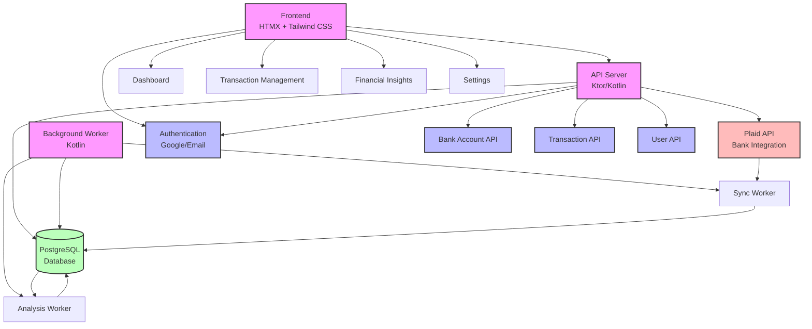

```mermaid
graph TD
    %% Main Components
    Frontend[Frontend<br/>HTMX + Tailwind CSS]
    API[API Server<br/>Ktor/Kotlin]
    Worker[Background Worker<br/>Kotlin]
    DB[(PostgreSQL<br/>Database)]

    %% External Services
    Plaid[Plaid API<br/>Bank Integration]
    Auth[Authentication<br/>Google/Email]

    %% Frontend Components
    Dashboard[Dashboard]
    Transactions[Transaction Management]
    Insights[Financial Insights]
    Settings[Settings]

    %% API Endpoints
    BankAPI[Bank Account API]
    TransactionAPI[Transaction API]
    UserAPI[User API]

    %% Worker Tasks
    SyncWorker[Sync Worker]
    AnalysisWorker[Analysis Worker]

    %% Relationships
    Frontend --> API
    API --> DB
    Worker --> DB
    API --> Plaid
    Frontend --> Auth
    API --> Auth

    %% Frontend Subcomponents
    Frontend --> Dashboard
    Frontend --> Transactions
    Frontend --> Insights
    Frontend --> Settings

    %% API Subcomponents
    API --> BankAPI
    API --> TransactionAPI
    API --> UserAPI

    %% Worker Subcomponents
    Worker --> SyncWorker
    Worker --> AnalysisWorker

    %% Data Flow
    Plaid --> SyncWorker
    SyncWorker --> DB
    DB --> AnalysisWorker
    AnalysisWorker --> DB

    %% Styling
    classDef component fill:#f9f,stroke:#333,stroke-width:2px
    classDef service fill:#bbf,stroke:#333,stroke-width:2px
    classDef database fill:#bfb,stroke:#333,stroke-width:2px
    classDef external fill:#fbb,stroke:#333,stroke-width:2px

    class Frontend,API,Worker component
    class BankAPI,TransactionAPI,UserAPI,Auth service
    class DB database
    class Plaid external
``` 